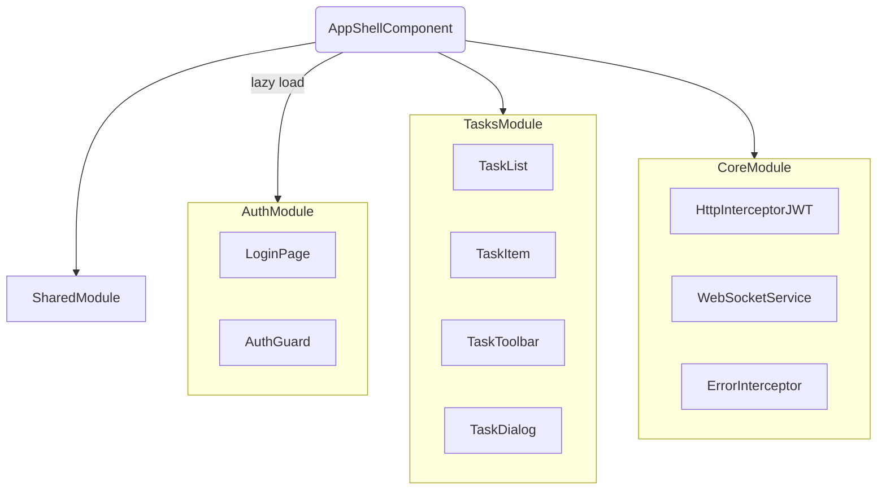
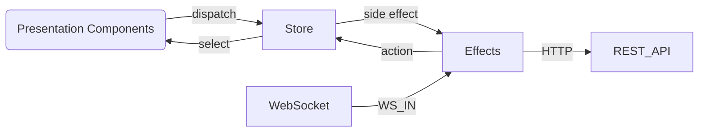
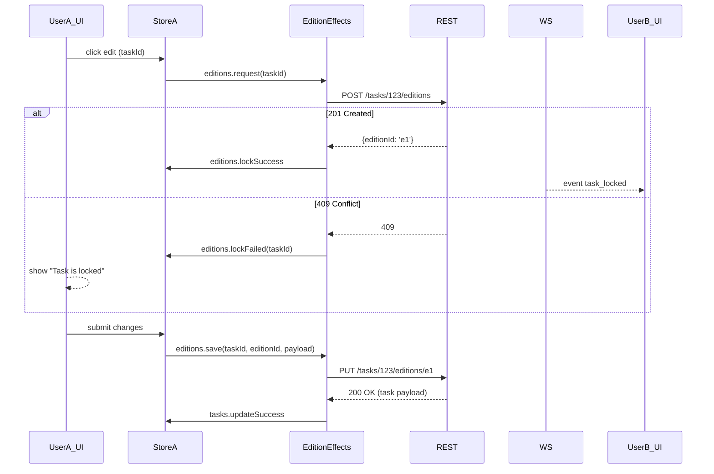

Frontend Design Document  
Project: Real-Time Collaborative To-Do List (Angular)

────────────────────────────────────────
1. Scope & Objectives
────────────────────────────────────────
• Build an Angular SPA that lets authenticated users create, read, update and delete tasks.  
• Changes made in any browser tab or by any user must be broadcast instantly to every other connected client through a Web-Socket gateway.  
• While one user is editing a task, that task must be locked for everyone else.  
• Follow clean-code, modular architecture, state-management and security best practices.

────────────────────────────────────────
2. Tech Stack & Key Libraries
────────────────────────────────────────
Angular 17, TypeScript  
Angular Material (UI)  
NgRx 16 (Global state & side effects)  
RxJS 7 (Reactive streams)  
ngx-websocket / native WebSocket API  
ngx-jwt-decode (token parsing)  
no unit tests  
no git hooks, no linting, no prettifying

────────────────────────────────────────
3. High-Level Frontend Architecture
────────────────────────────────────────
• Strictly layered:  
  – Presentation  (pure components, OnPush)  
  – State         (NgRx: Store + Effects + Entity Adapter)  
  – Services      (REST, Socket, Auth)  
  – Core / Shared infrastructure

Mermaid – module overview


────────────────────────────────────────
4. Routing
────────────────────────────────────────
```
/login          → LoginPageComponent
/               → Redirect to /tasks
/tasks          → TaskListComponent        (AuthGuard)
/tasks/:id      → TaskDialogComponent*     (AuthGuard, edition lock)
```
(*) opened as a dialog using the Angular Material router-outlet=floating pattern so that deep-links work.

────────────────────────────────────────
5. State Management (NgRx)
────────────────────────────────────────
Feature slices
• auth      – token, profile  
• tasks     – entities, selectedTaskId, loading flags  
• editions  – lock status per task (taskId → editionId | null)  
• ui        – snackbar / dialog global messages

Store entity adapter keeps tasks in a normalized dictionary => O(1) updates.

Side-effects (NgRx Effects)
• TaskApiEffects       – REST CRUD calls  
• TaskSocketEffects    – react to socket events and dispatch store updates  
• EditionEffects       – POST /tasks/:id/editions and PUT /tasks/:id/editions/:editionId  
• AuthEffects          – login, refresh-token, logout

All API calls go through a centralized HttpClient service; JWT is injected by HttpInterceptorJWT; 401 triggers refresh-token flow.

────────────────────────────────────────
6. Data & Event Flow
────────────────────────────────────────
Mermaid – data movement


────────────────────────────────────────
7. Real-Time Gateway Integration
────────────────────────────────────────
WebSocketService
• Creates a single shared WS connection (Singleton) to wss://api.example.com/socket  
• Adds `?access_token=<JWT>` query string for auth.  
• Exposes RxJS `messages$` (Observable) (no sending).

TaskSocketService
• Filters/decodes messages relevant to tasks and maps them to NgRx actions:  
  – task_created, task_updated, task_deleted → upsert / remove in store  
  – task_locked   (edition started)          → editions.lockTask({taskId, editionId})  
  – task_unlocked (edition ended)            → editions.unlockTask({taskId})

Back-pressure & reconnect handling implemented with RxJS retryWhen + exponential back-off.

────────────────────────────────────────
8. Task Editing / Locking Workflow
────────────────────────────────────────
Sequence diagram


────────────────────────────────────────
9. Component Responsibilities
────────────────────────────────────────
TaskListComponent
• subscribes to tasks selectors: all tasks sorted, loading, error  
• dispatches loadTasks() once on init  
• renders list with virtual scroll + trackBy to minimise DOM churn.

TaskItemComponent
• receives Task entity as @Input  
• outputs (edit, toggleComplete, delete) events → list component dispatches proper actions.

TaskToolbarComponent
• global add button (opens empty TaskDialog)  
• filter / search (update a local BehaviourSubject, combineLatest with tasks$ for client search).

TaskDialogComponent
• For new task ⇒ immediate POST /tasks (no locking)  
• For edit ⇒ follows locking protocol (see sequence above).  
• Uses ReactiveForms; disables save button while editions slice saving flag true.

SnackbarService (ui slice)
• centralised toast handling. Effects pipe errors through a meta-action showSnackbar(…) so components stay pure.

────────────────────────────────────────
10. Authentication & Security
────────────────────────────────────────
Login flow
• POST /auth/login with credentials → {accessToken, refreshToken}.  
• accessToken stored only in memory (Store) & in sessionStorage as fallback on refresh (XSS mitigated with Angular default CSP).  
• refreshToken stored in httpOnly, sameSite=Strict cookie.

Guards & Interceptors
• AuthGuard blocks protected routes if no valid token (refresh if possible).  
• HttpInterceptorJWT attaches Authorization: Bearer <token>.  
• ErrorInterceptor translates 401/403/409 to domain actions.

WebSocket Security
• accessToken added as query param; the server validates and can disconnect on expiry.  
• Client automatically reconnects with fresh token after silent refresh.

────────────────────────────────────────
11. UI/UX Guidelines
────────────────────────────────────────
• Angular Material dark/light theme toggle (stored in `ui` slice).  
• Dialogs & snackbars for feedback, never use alert().  
• Keyboard and screen-reader accessible (ARIA labels, focus trapping inside dialogs).  
• OnPush change detection on every component except shell – boosts perf.

────────────────────────────────────────
12. Build & Dev-Ops Notes
────────────────────────────────────────
• Environments: dev, staging, prod (Angular file replacements).  
• prod build: `ng build --configuration production` (AOT, budgets, strict DI).  
• Dockerfile (multi-stage) outputs `nginx` static container; env variables injected at runtime through /assets/config.json.

────────────────────────────────────────
13. Appendix – Key Interfaces
────────────────────────────────────────
export interface Task {  
  id: string;  
  title: string;  
  description?: string;  
  completed: boolean;  
  priority?: 'low' | 'medium' | 'high';  
  dueDate?: string; // ISO  
  updatedAt: string;  
}

export interface EditionLock {  
  taskId: string;  
  editionId: string;  
  lockedBy: string; // userId  
  lockedAt: string;  
}

────────────────────────────────────────
End of Design Document
